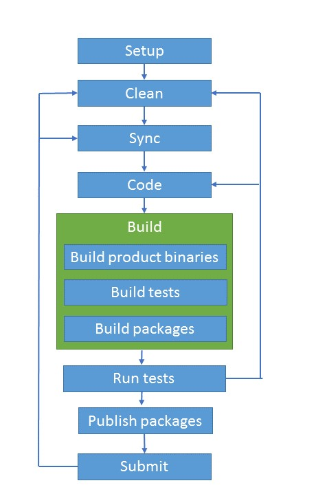

Dev Workflow
===============
The dev workflow describes the development process to follow. It is divided into specific tasks that are fast, transparent and easy to understand.

This provides flexibility as with discrete tasks people can iterate on a specific one without needing to run the full workflow, other processes can reuse the tasks as needed and anyone can put together the tasks as wanted to create a customized workflow.

## Process 

## Tasks

**Setup**

Set of instructions in order to have an environment ready to build the product. 
This means that at least two things need to happen:
* All the external tool dependencies that a repo has should be installed in the machine. Because it is repo specific, each repo should have a list of dependencies with the respective versions and links. An example of this dependencies is Git, CMake, VS.
* Download the files/tools that are needed in order to build the repo, for example, running init-tools to have the .Net CLI, Nuget and other tools available in the work environment.
The Setup task should be the first task to be run in a new or in a clean repo.

######Dependencies
None.

**Clean**

The Clean task is responsible for cleaning and leaving the work environment in a state as close as possible to the repository/code server. This can be accomplished by having a set of cleaning phases (cleaning the bin or NuGet packages folder or cleaning the NuGet packages cache folder) and a full clean-up option.

######Dependencies
Setup, as it may be required to run some tools in order to clean the work environment.

**Sync**

The Sync task gets the latest source history and the dependencies the Build needs in order to successfully build like, for example, restore the NuGet packages. 
It may require a pre-step to figure out what set of dependencies are needed for a build to run before restoring or downloading.
It is the task in charge of eliminating all the network traffic when building, allowing to do a build in offline mode. This way we are able to hit the network only when we are intentional about it.

######Dependencies
The Setup task is required, so Sync needs to verify that the tools are ready to be consumed, otherwise, Sync can be responsible for running the Setup task too. 
Also, there are cases where the Clean task should be run before the Sync task to avoid version issues across the different tools installed during the Setup task.

**Build**

Builds the source code. The order of how we build depends on each repo or the situation.

* Build product binaries: Builds the product binaries without the need of hitting the network to restore packages. It doesn't build tests, run tests or builds packages.
* Build packages: Builds the NuGet packages from the binaries that were built in the Build product binaries step. If no binaries were produced, build package will be in charge of building the product binaries as well. 
* Build tests: Builds the tests that are going to be run against the product. The tests to build could be the local tests of the repo or could test that are located in an external resource.

######Dependencies
* The Sync task is required in order to run the Build task. Build could be flexible to enforce Sync to always run as a separate task causing the Build to fail if it wasn’t run, or always run Sync as a pre-step before building.
* Build should have a possibility to be able to build all components (binaries, packages, and tests) or just a specific one with its dependencies.

**Run Tests**

Runs a set of tests against a set of product binaries in a specified work environment.

######Dependencies
* One of the inputs of this task is the test binaries. If there are no test binaries available, the task should fail.
* The product binaries should be available for this task to be able to run. Because the product binaries could come from different sources or work environments, the task Run Tests should fail if they are not provided.
* A work environment should be provided. By default, it would try to run the tests in the work environment.

**Publish Packages**

Publishes the NuGet packages that were built in the Build packages task to a specified location. If no packages were built, it should fail and let the developer know.

######Dependencies
Build-packages
